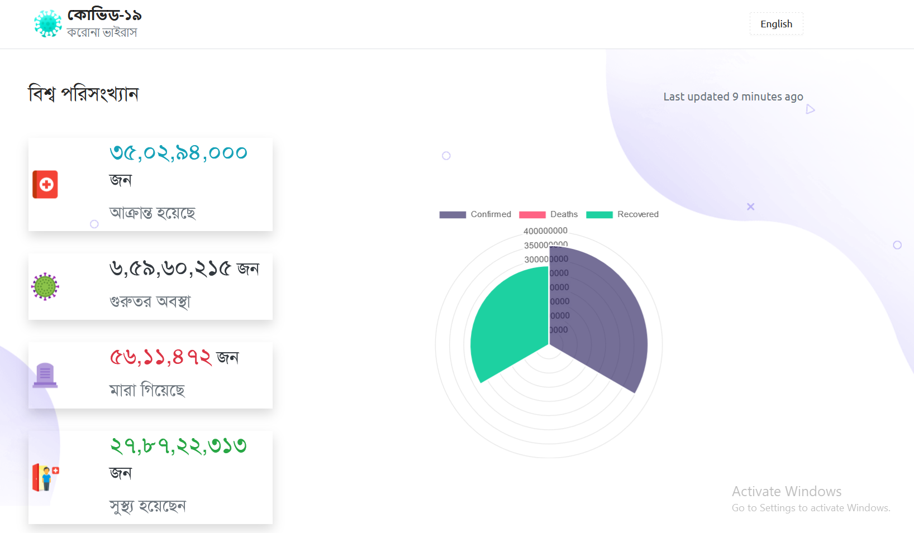
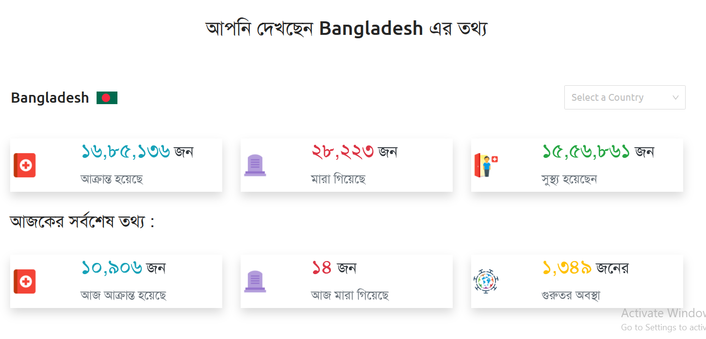
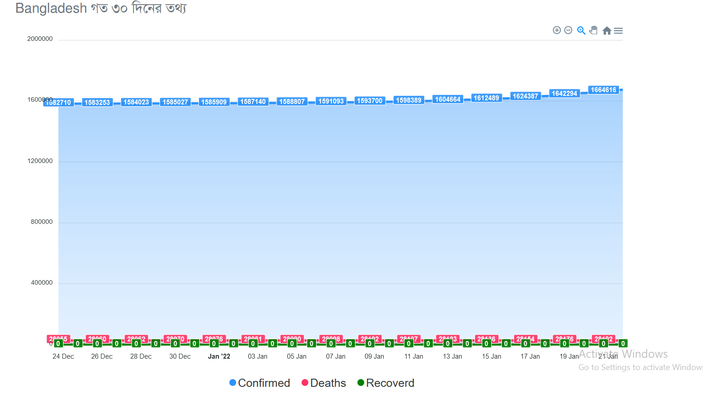
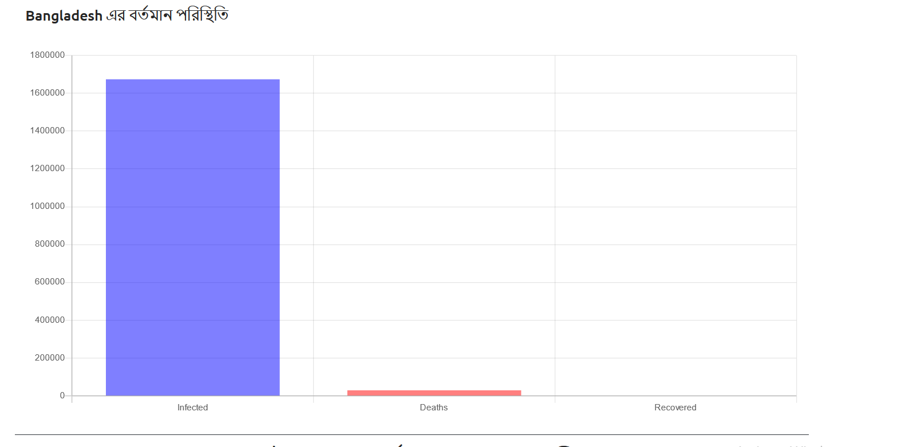
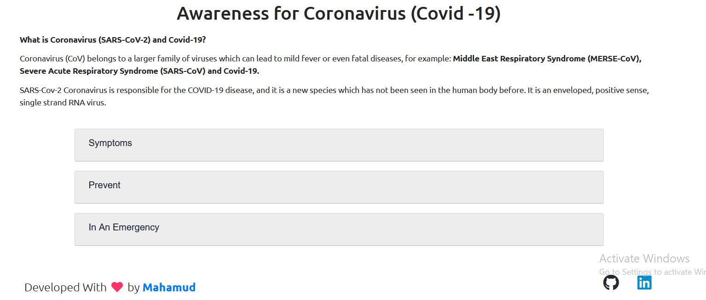

# COVID-19
This is a simple web app for tracking coronavirus (Covid-19).

## Key Features
Some of the standout features of the project are

 1. Two languages support English and Bengali.
 2. Can see globally total Infected, Recovered and Deaths people.
 3. Also can see individual country updates
 4. Graphical visualization.
 

## Technologies
 
1. React.js (Front-end)
2. css3 (Styling)
3. API used : [https://corona.lmao.ninja/v2](https://corona.lmao.ninja/v2)

## Known Bugs

Feel free to email me at mahamud01795@gmail.com if you run into any issues or have questions, ideas or concerns. Please enjoy
and feel free to share your opinion, constructive criticism, or comments about my work. Thank you! 🙂

### To run this project :
1. Clone this repos
2. Change your directory : `cd covid-19`
3. Run `npm install`
5. Run `npm start`

## Deployed Version

Feel free to visit 👉 https://covid-19detector.netlify.app/
